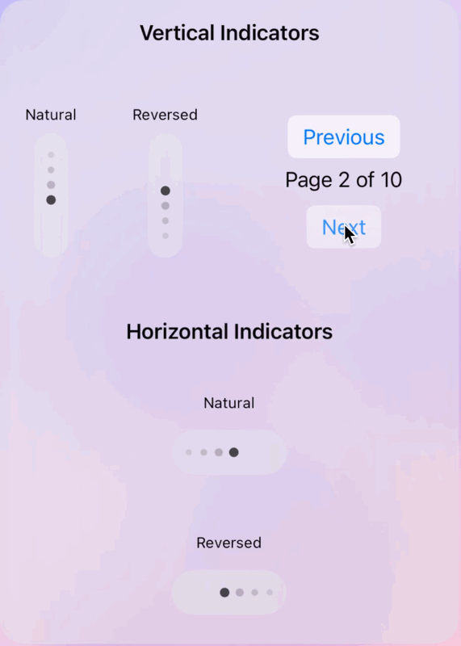

# DotPageIndicator

A modern, fully customizable dot-based page indicator for SwiftUI that goes beyond UIPageControl's limitations. Perfect for apps with scrollable content, carousels, or onboarding flows - especially when dealing with many pages. Unlike UIPageControl, DotPageIndicator provides smooth scrolling animations and maintains great usability even with large numbers of pages.


## Preview



## Key Advantages

- **Superior to UIPageControl**: Handles large page numbers gracefully with a scrolling interface
- **Smooth Animations**: Beautiful scroll animations that UIPageControl lacks
- **Highly Customizable**: Every aspect can be styled to match your app's design
- **SwiftUI Native**: Built from ground up for SwiftUI with modern API design
- **Easy to Implement**: Just a few lines of code to get started

## Features

- Support for both vertical and horizontal orientations
- Customizable scroll directions (natural and reversed)
- Customizable dot appearance (size, spacing, colors)
- Smooth animations with spring effects
- Adaptive scaling and opacity for better visual feedback
- Optional content state indication for each dot
- Multiple built-in styles (default, minimal, dark)
- Background customization with material effects
- iOS 15+, macOS 12+, tvOS 14+, watchOS 7+ support

## Installation

### Swift Package Manager

You can add DotPageIndicator to your project using Swift Package Manager by adding it as a dependency in your `Package.swift` file:

```swift
dependencies: [
    .package(url: "https://github.com/HanlunWang/DotPageIndicator.git", from: "1.0.0")
]
```

Or in Xcode:

1. Go to File > Add Packages
2. Enter package URL: `https://github.com/HanlunWang/DotPageIndicator.git`
3. Click "Add Package"

## System Requirements

- iOS 15.0+
- macOS 12.0+
- tvOS 14.0+
- watchOS 7.0+
- Swift 5.5+

## Usage

### Basic Usage

```swift
@State private var currentPage = 0
let totalPages = 5

// Vertical indicator (default - top to bottom)
DotPageIndicator(
    currentIndex: $currentPage,
    totalItems: totalPages
)
.frame(width: 50)

// Vertical indicator (bottom to top)
DotPageIndicator(
    currentIndex: $currentPage,
    totalItems: totalPages,
    style: .init(
        orientation: .vertical,
        scrollDirection: .reversed
    )
)
.frame(width: 50)

// Horizontal indicator (left to right)
DotPageIndicator(
    currentIndex: $currentPage,
    totalItems: totalPages,
    style: .init(
        orientation: .horizontal,
        scrollDirection: .natural
    )
)
.frame(height: 50)

// Horizontal indicator (right to left)
DotPageIndicator(
    currentIndex: $currentPage,
    totalItems: totalPages,
    style: .init(
        orientation: .horizontal,
        scrollDirection: .reversed
    )
)
.frame(height: 50)
```

### Custom Styling

```swift
DotPageIndicator(
    currentIndex: $currentPage,
    totalItems: totalPages,
    style: DotPageIndicatorStyle(
        orientation: .horizontal,          // Choose orientation
        scrollDirection: .natural,         // Choose scroll direction
        dotSpacing: 12,                   // Space between dots
        dotSize: 8,                       // Size of each dot
        visibleDots: 5,                   // Number of visible dots
        selectedDotColor: .blue,          // Color of the selected dot
        activeDotColor: .gray,            // Color of active dots
        inactiveDotColor: .gray.opacity(0.3), // Color of inactive dots
        selectedDotScale: 1.4,            // Scale factor for selected dot
        normalDotScale: 0.8               // Scale factor for other dots
    )
)
```

### Built-in Styles

```swift
// Default style
DotPageIndicator(
    currentIndex: $currentPage,
    totalItems: totalPages,
    style: .default
)

// Minimal style (transparent background)
DotPageIndicator(
    currentIndex: $currentPage,
    totalItems: totalPages,
    style: .minimal
)

// Dark style (white dots on dark background)
DotPageIndicator(
    currentIndex: $currentPage,
    totalItems: totalPages,
    style: .dark
)
```

### Content State Indication

```swift
DotPageIndicator(
    currentIndex: $currentPage,
    totalItems: totalPages,
    hasContent: { index in
        // Return true if the item at this index has content
        return true
    }
)
```

## Customization

### Using Built-in Styles

```swift
// Default style
DotPageIndicator(
    currentIndex: $currentPage,
    totalItems: totalPages,
    style: .default
)

// Minimal style
DotPageIndicator(
    currentIndex: $currentPage,
    totalItems: totalPages,
    style: .minimal
)

// Dark style
DotPageIndicator(
    currentIndex: $currentPage,
    totalItems: totalPages,
    style: .dark
)
```

### Custom Style Configuration

```swift
let customStyle = DotPageIndicatorStyle(
    dotSpacing: 12,              // Spacing between dots
    dotSize: 6,                  // Size of each dot
    visibleDots: 7,             // Number of visible dots
    indicatorWidth: 20,         // Width of the indicator
    verticalPadding: 8,         // Vertical padding
    horizontalPadding: 4,       // Horizontal padding
    backgroundCornerRadius: 20, // Corner radius of background
    backgroundColor: AnyShapeStyle(.ultraThinMaterial),
    selectedDotColor: .blue,    // Color for selected dot
    activeDotColor: .blue.opacity(0.4), // Color for active dots
    inactiveDotColor: .gray.opacity(0.2), // Color for inactive dots
    selectedDotScale: 1.4,      // Scale for selected dot
    normalDotScale: 0.8,        // Scale for normal dots
    selectedDotOpacity: 1.0,    // Opacity for selected dot
    normalDotOpacity: 0.2,      // Opacity for normal dots
    animationResponse: 0.3,     // Animation response time
    animationDampingFraction: 0.8 // Animation damping
)

DotPageIndicator(
    currentIndex: $currentPage,
    totalItems: totalPages,
    style: customStyle
)
```

## License

DotPageIndicator is available under the MIT license. See the LICENSE file for more info.
